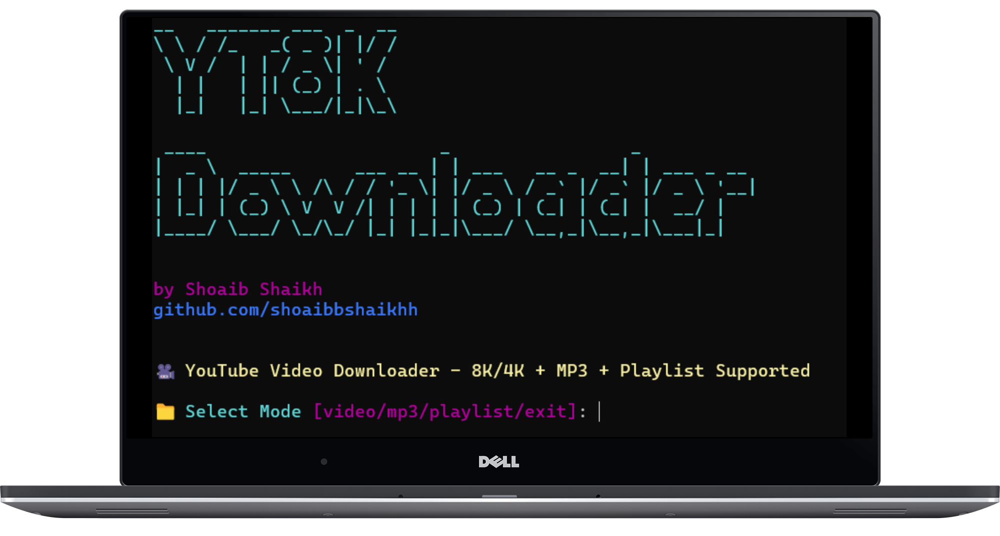

# 🎥 YT8K Downloader - YouTube Video 8K Downloader



[](https://www.python.org/)
[](LICENSE)

A powerful terminal-based YouTube downloader built in Python that supports 8K/4K video, MP3 extraction, playlist downloads, auto-folder creation, and a beautiful CLI interface.

> Built for developers, students, and media enthusiasts who want full control from the terminal.

---

## 🚀 Features

- ✅ Download videos in up to **8K resolution**
- 🎵 Extract **MP3 audio** with high quality
- 📃 Full **playlist downloading** support
- 📁 Auto-creates download folders if not specified
- 🖼️ Thumbnail preview before download
- 📋 Clipboard auto-fetch for URLs
- 🎯 Quality selector via indexed menu
- 🔁 Loop mode: continuous downloads without restarting
- 😎 Beautiful CLI with banner using `pyfiglet` and `rich`

---

## 📦 Requirements

- Python **3.10+**
- FFmpeg (for MP3 extraction)
- Install dependencies:

```bash
pip install -r requirements.txt
```

### `requirements.txt`

```
yt-dlp
rich
pyfiglet
pyperclip
requests
pillow
```

---

## 🛠️ How to Run

1. **Clone the repository:**

```bash
git clone https://github.com/shoaibbshaikhh/yt8k_downloader.git
cd yt8k_downloader
```

2. **Install dependencies:**

```bash
pip install -r requirements.txt
```

3. **Run the tool:**

```bash
python app.py
```

---

## 📋 Usage Modes

| Mode      | Description                                 |
|-----------|---------------------------------------------|
| `video`   | Download video in selected quality (up to 8K) |
| `mp3`     | Extract audio as MP3                         |
| `playlist`| Download entire playlist                    |
| `exit`    | Exit the tool                                |

---

## 💡 Tips

- Don’t paste URLs manually — copy the link and press Enter to auto-detect from clipboard.
- If no download path is given, a default `downloads/` folder will be created.
- You need **FFmpeg** installed in your system path for MP3 support.

---

## 🙏 Credits

- Developed by [**Shoaib Shaikh**](https://github.com/shoaibbshaikhh)
- Powered by [yt-dlp](https://github.com/yt-dlp/yt-dlp) for downloading
- UI enhancements by [Rich](https://github.com/Textualize/rich)
- ASCII Banner by [pyfiglet](https://github.com/pwaller/pyfiglet)